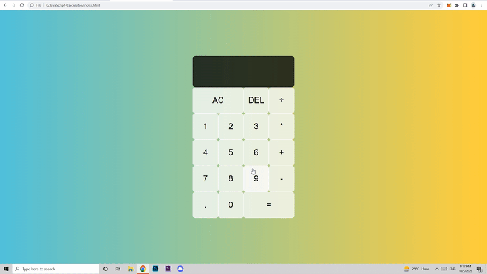

# JavaScript HTML CSS-based Calculator

This project covers the interactions with UI and key JavaScript methods.

It has all of the basic calculator functions, such as addition, subtraction, multiplication, division, delete, all-clear, and, of course, the ability to perform these operations with decimal numbers.

It uses various HTML and CSS elements along with Vanilla JavaScript and modern ES6 practices used in building a functional and responsive calculator, as shown in the example below:

## Requirements

* VS Code.

## Demo

## Code

* [Code](code/)
